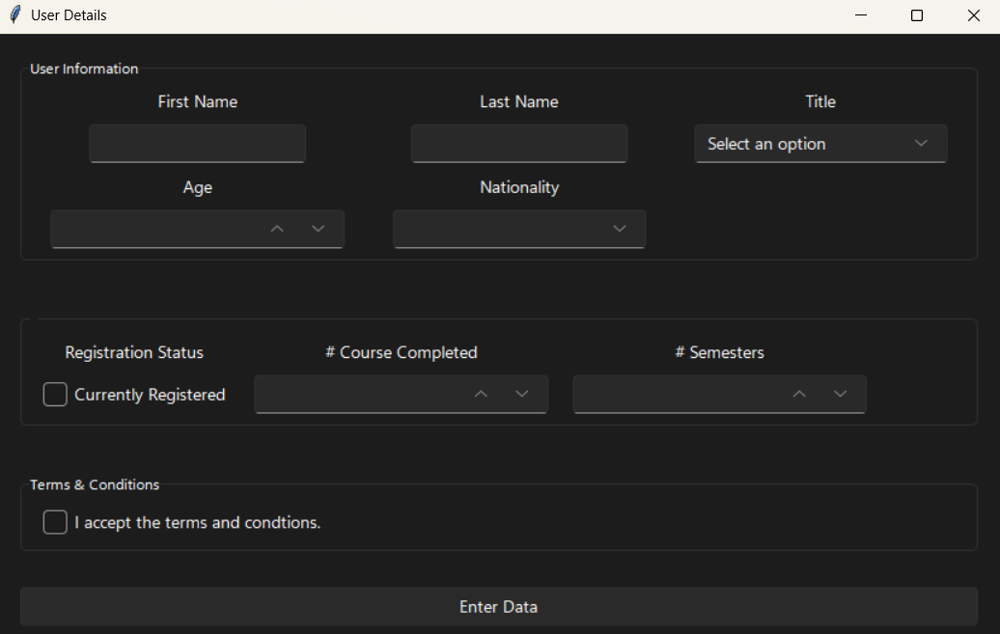

# Data Entry Form



## Introduction

This project is a basic **Data Entry Form** developed using Python and the Tkinter library. It simplifies the process of entering student information, making data collection more efficient. The students' information is saved in a database, enabling convenient access and modification when required. This tool is especially useful for educational institutions managing large volumes of student records.

## Features

- **Quick and Easy Data Entry** - The data entry form allows users to efficiently input information into a system with minimal effort, often utilizing streamlined forms and automated tools to enhance accuracy and speed.
- **Reduced Human Error** - The tool is designed to minimize accidental changes and forgetfulness, ensuring accurate data collection through user-friendly features and safeguards.
- [**List of Nationalities**](nationality.py) - The tool includes an updated list of nationalities for users to select from, streamlining the data entry process and ensuring consistency.
- **Database Management** - The details collected are stored in a database, ensuring secure and organized data management while facilitating easy retrieval and analysis.

## Personal Details

- First Name
- Last Name
- Salutation
- Age
- Nationality
- Number of Courses
- Number of Semesters
- Registration Status

## Sample Database

| ID | First Name | Last Name | Salutation | Age | Nationality | # Courses | # Semesters | Registered |
| --- | --- | --- | --- | --- | --- | --- | --- | --- |
| 1 | Bruce | Wayne | Mr. | 43 | American | 25 | 3 | Yes |
| 2 | Tony | Stark | Mr. | 36 | American | 18 | 4 | Yes |
| 3 | Dunkin | Donut | Dr. | 21 | Canadian | 8 | 2 | No |
| 4 | Perry | the Platypus | Engr. | 18 | Mexican | 4 | 1 | Yes |
| 5 | Diana | Woods | Mrs. | 22 | Puerto Rican | 22 | 3 | No |

## Requirements

- Python 3.x
- Sqlite3
- sv_ttk

## Installation

1. Clone the repository:

```powershell
git clone https://github.com/klaus-001/data-entry-form.git
cd data-entry-form
```

2. Install dependencies:

```powershell
pip install sv_ttk
```

## Usage

To run the program, execute the following command in your terminal:

```
python main.py
```

## Contributing

Contributions are welcome! To get started, fork the repository and create a new branch for your change. When you're ready, submit a pull request with a clear description of the update.

## License

This project is not licensed.