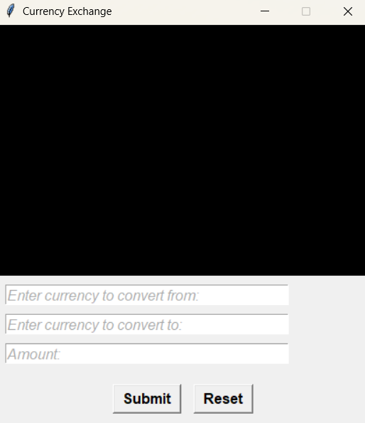

# Currency Exchange App



## Introduction

The **Currency Exchange App** easily converts between multiple currencies using real-time exchange rates. Users can quickly input amounts and select currencies to get accurate conversions instantly. The app is designed to offer a reliable and user-friendly solution for individuals and professionals who require quick and accurate currency conversions. This project uses Python and the standard Tkinter GUI library for a simple and seamless user interface design.

## Code Overview

- **load_data()** - The function sends a GET request to the `openexchangerates` API, seamlessly retrieving real-time exchange rate data from its database.
- **convert()** - Converts the initial currency and amount to the user's preferred currency and its equivalent value.
- **submit()** - Sends a signal to execute the user's command in converting the currencies
- **reset()** - Sends a signal to execute the user's command in resetting the input fields.
- **clear_entry()** - This function clears the entry and label fields in the widget.

## List of Currencies

Get a JSON list of all currency symbols available from the Open Exchange Rates API, along with their full names, for use in your integration.

This list will always mirror the currencies available in the latest rates (given as their 3-letter codes).

- [Available Currencies](currencies.json)

## Requirements

- Python 3.x
- Requests
- Python DotEnv

## Installation

1. Clone the repository:

```powershell
git clone https://github.com/klaus-001/currency-exchange.git
```

2. Install dependencies:

```powershell
pip install requests python-dotenv
```

## Usage

To run the program, execute the following command in your terminal:

```powershell
python main.py
```

## Contributing

Contributions are welcome! Feel free to fork this repository, make changes, and submit a pull request. For major changes, please open an issue first to discuss what you would like to change.

## License

This project is not licensed. You are welcome to use the code in any way you wish, contributions are encouraged.