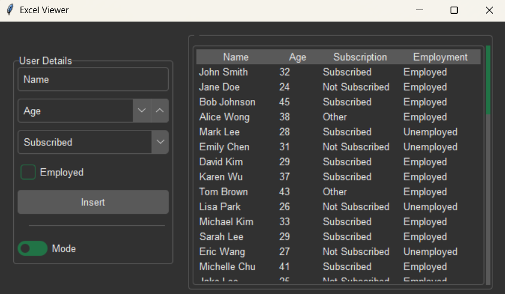

# Excel Viewer

This project is an **Excel Viewer** application that allows users to enter data and view spreadsheet tables. It supports real-time updates and provides a simple interface for interacting with Excel files. The tool is ideal for users who need to make quick data entries without opening Excel itself.



## Features

- **Data Entry Form** - The Excel Viewer includes a data entry section where users can insert rows of information — such as name, age, subscription, and employment — directly into the Excel file, enabling quick and easy data input.
- **Excel Table Viewing** - The Excel Viewer features a table viewing section that lets users browse the contents of an Excel file without needing to open it in Excel.
- **Light Mode/Dark Mode** - Users can easily toggle between light mode and dark mode to suit their preferred viewing experience.

## Requirements

- Python 3.x
- Openpyxl
- Forest ttk theme

## Installation

1. Clone the repository:

```bash
git clone https://github.com/klaus-001/excel-viewer.git
```

2. Navigate to the directory:

```bash
cd excel-viewer
```

3. Install dependencies:

```bash
pip install openpyxl
```

## Usage

To run the program, execute the following command in your terminal:

```bash
python main.py
```

## Contributing

Contributions are welcome!. To get started, fork the repository and create a new branch for your change. When you're ready, submit a pull request with a clear description of the update.

## License

This project is not licensed.

## Acknowledgements

- [***@rdbende***](https://github.com/rdbende/Forest-ttk-theme) - Created the Forest ttk theme used for this project.
- [***Code First with Hala***](https://www.youtube.com/watch?v=8m4uDS_nyCk) - whose structure and code served as a learning model for this project.
