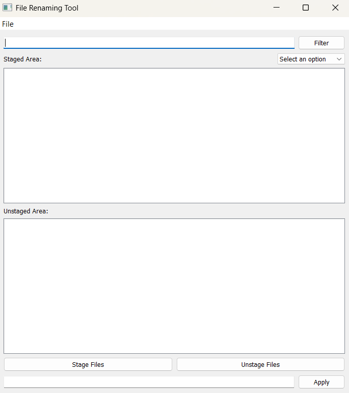

# File Renaming Tool



## Introduction

The **File Renaming Tool** is a user-friendly application designed to efficiently rename single or multiple files within a selected directory. Built with Python and PyQt5, the tool offers a clean, intuitive interface that simplifies the file renaming process for users of all experience levels. Whether you're batch-renaming hundreds of files or just making quick adjustments to a few, this tool streamlines the task with ease and precision.

## Features

#### Unstaged Area

The Unstaged Area displays all files from the selected directory once it has been loaded. This area allows users to view and browse through the complete list of available files before making any selections for renaming.

#### Staged Area

The Staged Area contains files that the user has specifically selected for renaming. Files are moved here from the Unstaged Area, but no changes are applied or reflected while in this area — it simply acts as a holding zone for files to be edited.

#### Filtering and Selection

Users can efficiently filter and locate specific files using regular expressions or by directly searching for filenames. This functionality allows users to quickly identify relevant files and move them directly into the Staged Area for further processing.

#### Renaming Options

Users can choose from a variety of renaming actions to customize file names according to their needs. Available options include:

- Add Prefix – Add text to the beginning of each filename
- Remove Prefix – Remove a specified prefix from filenames
- Add Suffix – Append text to the end of each filename
- Remove Suffix – Remove a specified suffix from filenames
- Rename – Replace the entire filename with a new one or based on a pattern

These options provide flexibility and control, making batch renaming simple and efficient.

#### Single or Multiple Filenames Edit

Users have the flexibility to edit either a single file or multiple files simultaneously, depending on their needs. This allows for both precise edits on individual files and efficient batch renaming for larger groups of files.

## Installation

1. Clone the repository:

```powershell
git clone https://github.com/klaus-001/file-renaming-tool.git
```

2. Install dependencies:

```powershell
pip install PyQt5
```

## Usage

To run the program, execute the following command in your terminal:

```powershell
python main.py
```

## License

This project is distributed under the MIT License. See [LICENSE](LICENSE.md) for more details.
