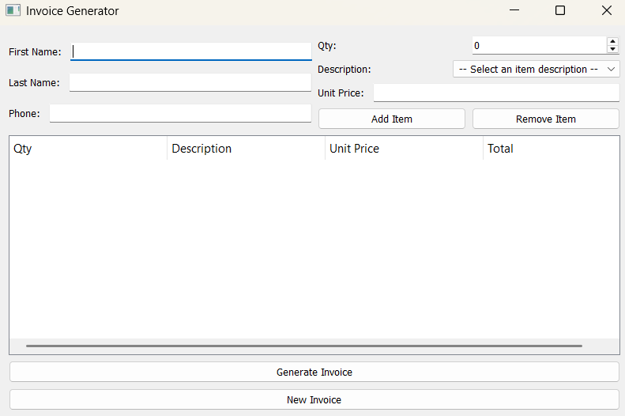

# Invoice Generator



## Introduction

This project is an **Invoice Generator** application designed to streamline the process of creating invoices for customers. Built using Python and PyQt5, it offers a user-friendly interface that makes interaction simple and efficient. Users can input customer information, list one or more item details, and generate a complete invoice with a single click of a button.

## Features

- Add items to the invoice list by entering the quantity, description, and unit price, then clicking the Add Item button. This process can be repeated as many times as needed to include multiple items.
- Automatic calculation of the total price for all items added to the invoice list, including applicable sales tax.
- The generated invoice is provided in both Word and PDF format.
- Easily remove unwanted items from the invoice list by selecting them in the viewing section and clicking the Remove Item button.

## How to Use

Fill in the customer details in their respective fields (first name, last name, and phone number). To add items to the invoice list, enter the quantity, description, and unit price, then click the **Add Item** button. You can repeat this step as many times as needed to include multiple items. Once all customer details are entered and no more items need to be added, click the **Generate Invoice** button.

If you need to remove any items from the invoice list, simply select them in the viewing section and click the **Remove Item** button — no need to start over. To discard the current invoice and begin a new one, click the **New Invoice** button.

## Requirements

- Python 3.x
- PyQt5
- docxtpl
- docx2pdf

## Installation

1. Clone the respository:

```bash
git clone https://github.com/klaus-001/invoice-generator.git
```

2. Navigate to the directory:

```bash
cd "DIRECTORY NAME"
```

3. Install dependencies:

```bash
pip install PyQt5 docxtpl docx2pdf
```

## Usage

To run the program, execute the following command in your terminal:

```bash
python main.py
```

## License

This project is not licensed.