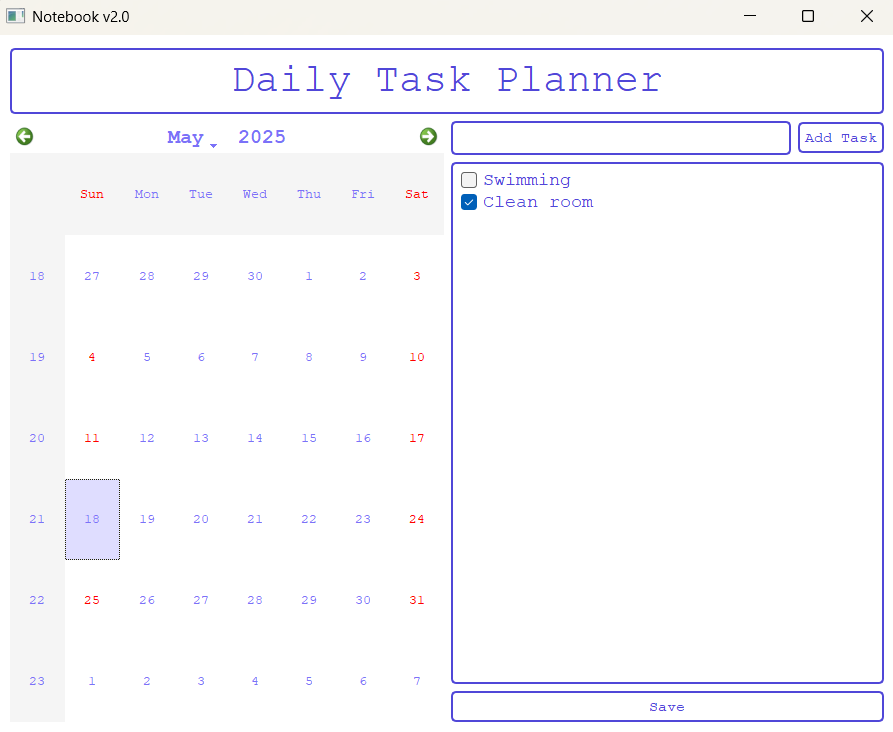

<h1 align="center">Notebook v2.0 </h1>

<p align="center">

</p>

## 🔗 Table of Contents

- [🗒️ Introduction](#🗒️-introduction)
- [✨ Features](#✨-features)
- [📦 Installation](#📦-installation)
- [🚀 Usage](#🚀-usage)
- [📂 Project Structure](#📂-project-structure)
- [🛠️ Technologies Used](#️🛠️-technologies-used)
- [📄 License](#📄-license)
- [🙋‍♂️ Contributing](#️🙋‍♂️-contributing)

## 🗒️ Introduction

**Notebook v2.0** is a daily task planner designed to help you stay organized and productive. It allows you to create and manage a checklist for each day of the month. Simply add your tasks for the day, and Notebook v2.0 tracks which ones are completed and which are still pending. It also maintains a detailed history of your past tasks, preserving their status — completed or not — so you can easily review your progress over the week or month.

## ✨ Features

- ✅ Create and manage daily checklists
- 📅 View tasks for any selected day of the month
- 👆 Click save to update task status and save checklist 
- 📈 View past activity to track your productivity
- 🧠 Clean, intuitive interface

## 📦 Installation

### Clone the Repository

```bash
git clone https://github.com/klaus-001/productivity-log.git
cd productivity-log
```

### Install Dependencies (if applicable)

```bash
pip install PyQt5
```
## 🚀 Usage

1. **Start the application:**

    ```bash
    python main.py
    ```

2. **Add Tasks:**

    - Choose any day of the month.
    - Enter tasks into the daily checklist.

3. **Track Progress:**

    - Mark tasks as complete or incomplete.
    - Click the save button to update or save any changes.

4. **Review History:**

    - Select a previous date to view the checklist and task statuses.

## 📂 Project Structure

```
notebook-v2.0/
├── main.py
├── img/
├── README.md
└── data.json
```

## 🛠️ Technologies Used

- Python 3.x

## 📄 License

This project is not licensed.

## 🙋‍♂️ Contributing

Contributions are welcome! Please fork the repo, create a branch, and submit a pull request.

If you find a bug or have a feature request, feel free to open an issue.

---

***Have fun tracking your daily tasks!***

